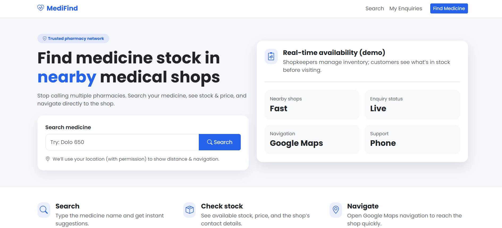
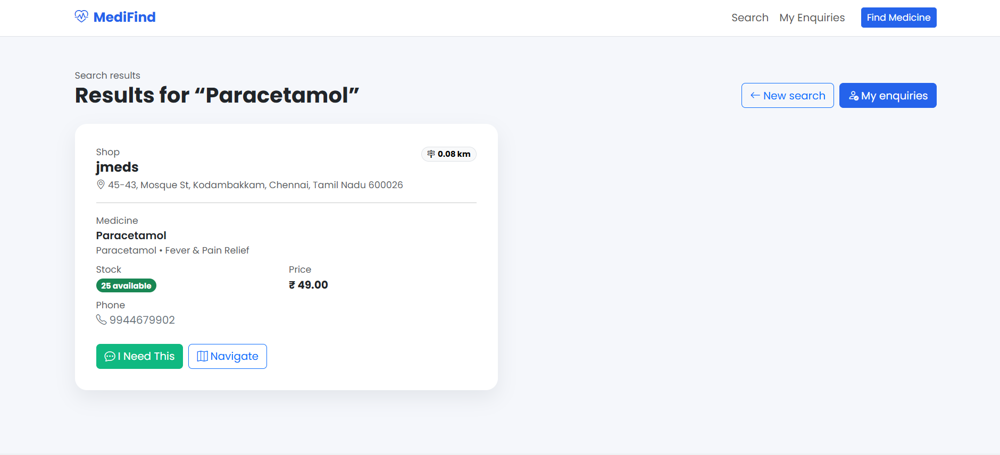
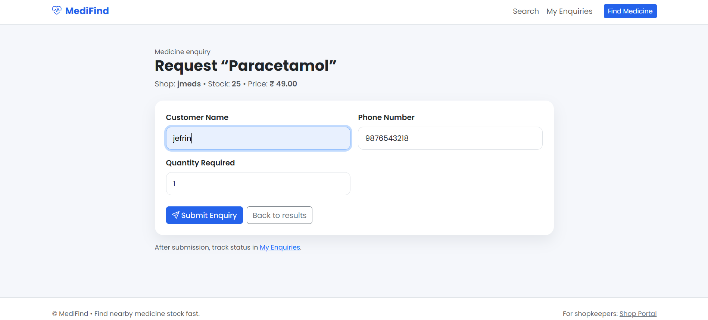
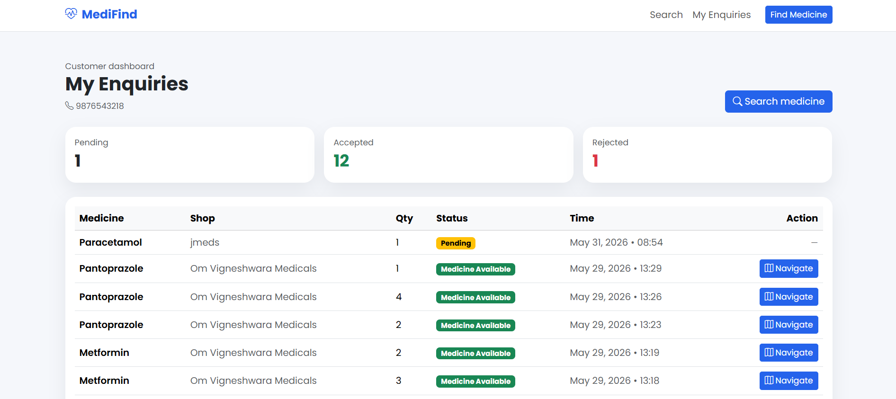
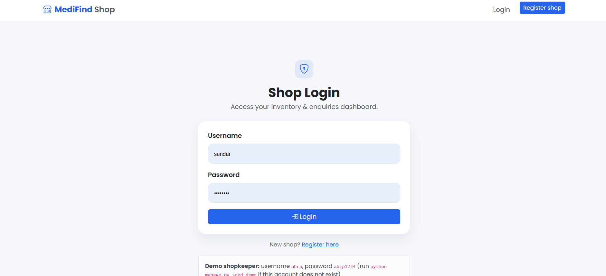
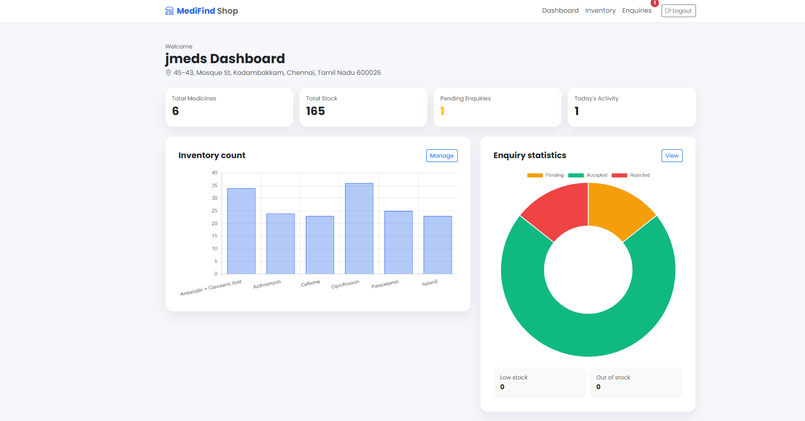
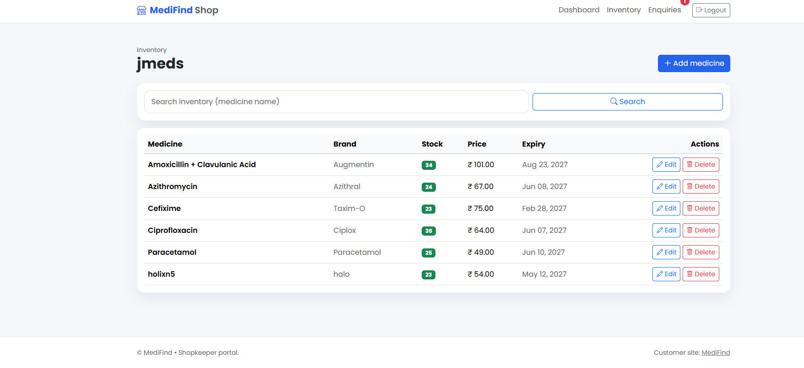
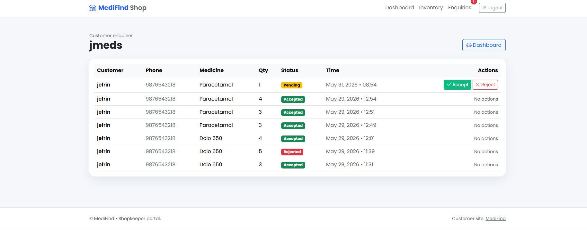
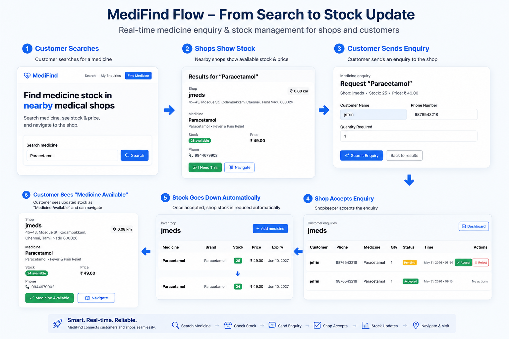

<<<<<<< HEAD
# MediFind

**Find medicine near you — before you walk to the shop.**

MediFind is a simple website that helps people find which nearby medical shop has a medicine in stock. Shopkeepers can manage their inventory and reply to customer requests.

> Written so anyone can follow — even if you are new to coding.

---

## What problem does MediFind solve?

Imagine you need **Dolo 650** for a fever.

You might visit **3 or 4 shops** and hear: *"Sorry, not available."*

MediFind lets you:

1. **Search** the medicine name on your phone or laptop  
2. **See** which shop has stock, price, and phone number  
3. **Ask** the shop to hold it (enquiry)  
4. **Go** to the shop using Google Maps navigation  

---

## How it works (in 4 easy steps)

```text
Customer searches  →  Shops show stock  →  Customer sends enquiry  →  Shop accepts
                                                              ↓
                                                    Stock goes down automatically
                                                              ↓
                                              Customer sees "Medicine Available" + Navigate
```

### Step 1 — Customer searches

Open the website home page and type a medicine name (example: **Dolo 650**).



### Step 2 — See nearby shops with stock

You see shop name, stock count, price, address, and phone. You can tap **Navigate** to open Google Maps.



### Step 3 — Send an enquiry ("I Need This")

Fill in your name, phone number, and how many tablets you need.



### Step 4 — Track status on your dashboard

Open **My Enquiries**. You will see:

- **Pending** — shop has not replied yet  
- **Medicine Available** — shop accepted your request  
- **Rejected** — shop cannot fulfill it  

When accepted, a **Navigate** button appears so you can go to the shop.



---

## Two separate websites inside one project

MediFind has **two portals**. They look different and do different jobs.

| Portal | Who uses it? | Main URL |
|--------|--------------|----------|
| **Customer Portal** | People looking for medicine | `http://127.0.0.1:8000/` |
| **Shopkeeper Portal** | Medical shop owners | `http://127.0.0.1:8000/shop/` |

There is also **Django Admin** for super-users: `http://127.0.0.1:8000/admin/`

> **Important:** The shop portal login is **not** the same as Django admin.  
> Shopkeepers use `/shop/login/`. Admin users use `/admin/`.

---

## Shopkeeper portal (for medical shops)

### Login



**Demo login (after running seed command):**

| Field | Value |
|-------|-------|
| Username | `abcp` |
| Password | `abcp1234` |

### Dashboard

See totals: medicines, stock, pending enquiries, and charts.



### Inventory

Add, edit, or delete medicines. Search your stock. Low stock and out-of-stock items are highlighted.



### Enquiries

When a customer sends a request, it appears here. Click **Accept** or **Reject**.

- **Accept** → customer status becomes *Medicine Available*  
- **Accept** → **stock quantity reduces automatically** by the quantity the customer asked for  



---

## Full demo story (try this at home)

You can test with **two browser windows** — one as customer, one as shopkeeper.

### Window A — Customer

1. Go to `http://127.0.0.1:8000/`
2. Search: **Dolo 650**
3. Click **I Need This**
4. Name: **Jefrin**, Phone: **9876543210**, Quantity: **2**
5. Submit → open **My Enquiries** (status: Pending)

### Window B — Shopkeeper

1. Go to `http://127.0.0.1:8000/shop/login/`
2. Login: `abcp` / `abcp1234`
3. Open **Enquiries** → click **Accept**
4. Open **Inventory** → Dolo 650 stock should be **2 less** than before

### Back to Customer

Refresh **My Enquiries**:

- Status: **Medicine Available**
- **Navigate** button is visible



---

## Install and run (Windows)

### What you need

- **Python 3.11+** installed  
- This project folder on your computer  

### 1. Open terminal in the project folder

Example path:

```text
C:\Users\admin\Desktop\medifind
```

### 2. Create and activate virtual environment (first time only)

```powershell
python -m venv venv
.\venv\Scripts\Activate.ps1
```

### 3. Install packages

```powershell
pip install -r requirements.txt
```

### 4. Prepare the database

```powershell
python manage.py migrate
python manage.py seed_demo
```

`seed_demo` creates:

- Shop: **ABC Medicals**
- Medicine: **Dolo 650** (25 in stock)
- Shopkeeper user: **abcp** / **abcp1234**

### 5. Start the server

```powershell
python manage.py runserver
```

Open in browser: **http://127.0.0.1:8000/**

### 6. (Optional) Create Django admin user

```powershell
python manage.py createsuperuser
```

Then visit: **http://127.0.0.1:8000/admin/**

---

## Project folder structure (simple map)

```text
medifind/
├── manage.py                 # Start the project from here
├── requirements.txt          # Python packages list
├── medifind/                 # Main project settings & URLs
├── api/                      # Database models (Shop, Medicine, Inventory, Enquiry)
├── customers/                # Customer portal (search, enquiry, dashboard)
├── shops/                    # Shopkeeper portal (login, inventory, enquiries)
├── templates/                # HTML pages (Bootstrap UI)
├── static/                   # CSS, JavaScript, images
└── docs/screenshots/         # Put README screenshots here
```

---

## Main features

### Customer portal

- Modern home page with search  
- Medicine name auto-suggest while typing  
- Search results with stock, price, distance (uses browser location)  
- Google Maps **Navigate** button  
- Enquiry form (name, phone, quantity)  
- **My Enquiries** dashboard with status  

### Shopkeeper portal

- Separate login and registration  
- Dashboard with stats and charts  
- Inventory CRUD (Create, Read, Update, Delete)  
- Inventory search  
- Enquiry management (Accept / Reject)  
- Notification badge for pending enquiries  
- **Auto stock update** when enquiry is accepted  

### Admin

- Manage shops, medicines, inventory, and enquiries via Django Admin  

---

## Technology used

| Tool | Why we use it |
|------|----------------|
| **Python** | Backend language |
| **Django** | Web framework |
| **SQLite** | Simple database for demo |
| **Bootstrap 5** | Nice, responsive design |
| **Chart.js** | Dashboard charts |
| **Google Maps links** | Navigation to shop |

---

## Screenshots for GitHub

Images in this README live in [`docs/screenshots/`](docs/screenshots/).

If you clone the repo and images look broken:

1. Run the app locally  
2. Take screenshots following [`docs/screenshots/README.md`](docs/screenshots/README.md)  
3. Commit the PNG files to GitHub  

---

## Planned improvements (roadmap)

These ideas are **not built yet** but are good next steps:

- **Sound + push alert** when a new enquiry arrives (with on/off setting for shopkeepers)  
- **POS (Point of Sale)** in the shop portal for walk-in customers  
- **WhatsApp invoice** sent to customer after purchase with a greeting message  

---

## Common problems

### "Page not found" at `/accounts/login/`

Use the shop login page instead: **http://127.0.0.1:8000/shop/login/**

### "Not a shopkeeper account"

You logged in with **Django admin** (`admin` user). Log out and use shop credentials:

- Username: `abcp`  
- Password: `abcp1234`  

Or register a new shop at **http://127.0.0.1:8000/shop/register/**

### No search results

Run demo data again:

```powershell
python manage.py seed_demo
```

---

## License

This project is for learning and demo purposes. You may adapt it for school or portfolio use.

---

## Author note

**MediFind** — helping people spend less time searching and more time getting better.

If this README helped you, give the repo a star on GitHub.
=======
# medifind
>>>>>>> c4b9080a249209e369db432016415ea1da798b2e
